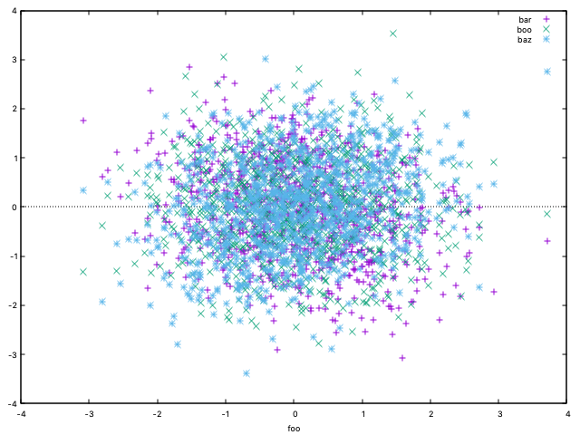
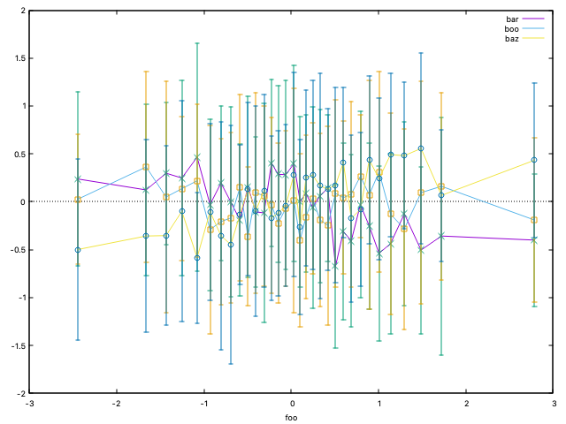
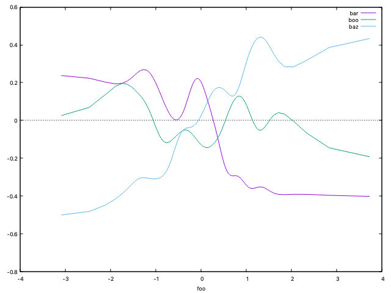

# `plot`

`plot` is python program for command-line plotting numeric data from
files or stdin.  A simple command-line plotting tool usable with unix
pipes, rather than interactive 'ecosystems' like R, jupyter or
mathematica notebook, or gnuplot, is something which is missing from
standard shell-based tools.  `plot` is an attempt to fill this void.

The program name is admittedly too generic but is in line with the
convention of most unix shell commands being (very) short.

The source also includes functions callable from user applications
after `import plot`.

## Supported inputs

CSV or whitespace-separated utf-8 text.  The input is expected in a
dataframe-like format starting with a header line with one or more
field names followed by data rows with as many numeric fields as there
are field names.  `plot` will plot any number of 'y' columns vs one
'x' column in the dataframe, and more (see below).  The zero-based
column numbers are supplied by the user.

## Supported graphic backends

* `gnuplot`. Requires a [gnuplot5](http://www.gnuplot.info/docs_5.0/gnuplot.pdf) installation.  Generates cleaner graphics in a popup window without blocking command line or calling application.
* `pyplot`.  Uses matplotlib.pyplot supplied with python istallation.

## Supported plot types

* 2D graphs for one or more y(x)
* Scatter plots
* 1D histogram of a column in a dataframe
* xy-histograms of one or more y(x)

## xy-histogram

is a useful exploratory data analysis (EDA) tool for visual detection
of relationships, including nonlinear, among data fields.
xy-histogram is the primary reason for writing the `plot` tool.

An xy-histogram is a refinement of scatter plot and offers better
visualization of high-noise data.  Given data arrays `(x[],y[])`,
`x`-bins `B[]` are chosen either uniform in `x` or to contain samples
of equal count (weight). An xy-histogram displays mean and optionally
standard deviation of the samples `y[i]` where `x[i]` fall in bin `B`
vs the bin position.  This representation of `y(x)` is similar to a
[KNN](https://en.wikipedia.org/wiki/K-nearest_neighbors_algorithm) ML
data learner whose complexity increases with finer bins.  `plot`
supports weighted xy-histograms by using a weight data column when
computing the mean and the standard deviation.

Command lines and resulting plots below demonstrate different views of
the same noisy data (generated in CSV format by the same tool):

### scatter plot: `plot -t | plot 1-4 -zp`

This view is not particularly telling.

### xy-histogram with errorbars: `plot -t | plot 1-4 -zeEHW 5`

When error bars are large, the dependence of Mean(y) of x is not
very visible.  Larger bins will generate smaller error bars.

### xy-histogram bezier-smoothed: `plot -t | plot 1-4 -zsEHW 5`

Plotting without error bar changes the y scale.  Smoothing removes
remaining noise and gives a better idea whether and how y depends on x.

## Usage

`plot` and the companion script `unplot` have help/examples options:

```
$ plot -h
usage: plot [-h] [-T TITLE] [-z] [-w] [-l] [-n] [-c] [-s] [-d] [-p] [-H]
            [-B NBINS] [-W WTS_COL] [-e] [-E] [-g GREP_KEY] [-D DRIVER] [-v]
            [-t]
            [files_and_columns [files_and_columns ...]]

Plot columnar data in files or stdin. Default action: Print columns available for plotting

positional arguments:
  files_and_columns

optional arguments:
  -h, --help            show this help message and exit
  -T TITLE, --title TITLE
                        Use this window title [filename]
  -z, --xzeroaxis       Add horizontal zero line
  -w, --whitespace      Split input by whitespace [comma]
  -l, --list            Use sequence number for x data [first column]
  -n, --noheader        Indicate that data has no header.  Generate header names F0, F1, etc
  -c, --cumsum          Plot cumulative sums
  -s, --smooth          Plot bezier-smooth data
  -d, --diff            Plot differences
  -p, --points          Plot with points (e.g. for a scatter plot) [with lines]
  -H, --hist            Plot histogram: regular for single data column or xy histogram(s) for multiple columns (first treated as x)
  -B NBINS, --nbins NBINS
                        For histogram: use this many bins: sqrt: size**(1/2), qbrt: size**(1/3), or <int> [sqrt]
  -W WTS_COL, --wts_col WTS_COL
                        For histogram: use this column for weights
  -e, --yerr            For xy-historgram: plot with yerrorbars
  -E, --equal_wt        Use equal-weight histogram bins. Implies a density plot for x-histogram [equal-size]
  -g GREP_KEY, --grep_key GREP_KEY
                        Skip input lines without this word
  -D DRIVER, --driver DRIVER
                        Use this backend graphics driver: gnuplot or pyplot [gnuplot]
  -v, --verbose         Print gnuplot command line
  -t, --test_csv        Print a csv stream for testing

Examples:
  ls -l /usr/bin|grep -v total|plot -clw 4 # cumsum of file sizes
  plot -t | plot 0-4               # plot columns 1-4 vs column 0
  plot -t | plot 0-4 -zc           # cumulative plots
  plot -t | plot 0-4 -zs           # smoothed plots
  plot -t | plot 1-4 -p            # scatter plots
  plot -t | plot 1   -Hz           # histograms of column 1 data
  plot -t | plot 1-4 -Hz           # xy-histograms of columns 2-4 (y) vs column 1 (x)
  plot -t | plot 1-4 -HzW 5        # weighted xy-histograms
  plot -t | plot 1-4 -Hzs          # smoothed xy-histograms
  plot -t | plot 1-3 -eEHW 5 -B 10 # xy-histograms with equal-weight bins and errorbars
  unplot                           # kill all active gnuplot windows
```

## Installation

The script plot.py starts with the hashbang `#!/usr/local/miniconda3/bin/python` and can be symlinked to ~/bin/plot or /usr/local/bin/plot.

If this is not where your python is, a shell scipt ~/bin/plot can be cretaed to contain something like
```
#!/bin/bash
exec /your/python /path/to/plot.py $@
```

## Version info

* Initial release V. 0.5 by Michael Isichenko
* Tested with python 3.7.6 and gnuplot 5.4 on mac OSX and linux

## TODO

* Date/time data support
* Handling of missing values
* Named columns in addition to column numbers
* Input filtering (a.k.a. 'where' clause) based on data values
* `eval`-based support for arithmetic and boolean expressions with data columns
* Maybe: support surface/contour/heatmap plots while keeping a clean CLI
* Maybe: add [GP](https://en.wikipedia.org/wiki/Gaussian_process) instead of [Bezier](https://en.wikipedia.org/wiki/Bezier_curve) smoothing
