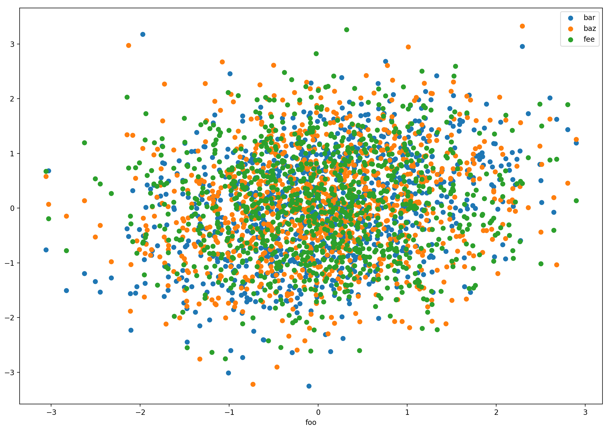
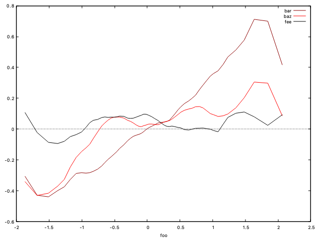

# `plot`

[plot](https://github.com/michael-isichenko/plot) is a python program for command-line plotting numeric data from files or stdin.  A simple command-line plotting tool usable with unix pipes, rather than interactive 'ecosystems' like R, jupyter or mathematica notebook, or gnuplot, is something which is missing from standard shell-based tools.  `plot` is an attempt to fill this void.

The program name is admittedly too generic but is in line with the convention of most unix shell commands being (very) short.

The source also includes functions callable from user applications after `import plot`.

## Supported inputs

CSV or whitespace-separated utf-8 text.  The input is normally expected in a dataframe-like format starting with a header line with one or more field names followed by data rows with as many numeric fields as there are field names.  `plot` will plot any number of 'y' columns vs one 'x' column in the dataframe, and more (see below).  The zero-based column numbers are supplied by the user.  Plotting from multiple files is also supported.  Most useful for a unix environment is plotting from standard input.  `plot -t` prints columns of random data usable for self-testing and demo plots.

## Supported graphics backends

* `gnuplot`. Requires a [gnuplot5](http://www.gnuplot.info/docs_5.0/gnuplot.pdf) installation.  Generates cleaner graphics in a popup window without an inconvenient blocking command line or calling application.  This is plot's default driver.
* `pyplot`.  Uses matplotlib.pyplot supplied with python installation, enabled with the `--driver pyplot` option.  This backend blocks the calling shell process until the Qt window is closed.

`plot` is can be used on unix-based systems with a graphics layer such as linux (X11) or OSX (Quartz, Cocoa).  Both gnuplot and matplotlib drivers support graphics-free non-blocking plotting to a pdf file (`--output` option).

## Supported plot types

* Scatter plots
* 2D graphs for one or more y(x)
* 1D histograms of column(s) in a dataframe
* regressograms for one or more y(x)

2D graphs, histograms, and regressograms can be smoothed by local linear regression using user-supplied bandwidth (`--llr` option).  Additional data manipulation include splines supported by gnuplot (`--smooth` option), cumulation (`--cumsum`), differencing (`--diff`), subsetting (`--start`, `--end`), and printing basic statistics (`--stats`).

## Regressogram

Regressogram (`--rgram` option) is a useful exploratory data analysis (EDA) tool for visual detection of relationships, including nonlinear, among data fields. Regressogram is the primary reason for writing the `plot` tool.

[Regressogram](https://bookdown.org/egarpor/NP-UC3M/kre-i-reg.html) is a refinement of scatter plot and offers better visualization of high-noise data.  Given data arrays `(x[],y[])`, `x`-bins `B[]` are chosen either uniform in `x` or to contain samples of equal count (weight). An regressogram displays mean and optionally standard
deviation of the samples `y[i]` where `x[i]` fall in bin `B` vs the bin position.  This representation of `y(x)` is similar to a [KNN](https://en.wikipedia.org/wiki/K-nearest_neighbors_algorithm) ML data learner whose complexity increases with finer bins.  `plot` supports weighted regressograms by using a weight data column when computing the mean and the standard deviation.

Command lines and resulting plots below demonstrate different views of the same noisy data (generated in CSV format by the same tool):

### Scatter plot: `plot -t | plot 1-4 -pD plt`


This view is not particularly telling.

### Regressogram with errorbars: `plot -t | plot 1-4 -rERW 5 -B 60`


When error bars are large, the dependence of Mean(y) of x is not very visible.  Larger bins will generate smaller error bars at the price of fewer details of the y(x) dependency (bias-variance tradeoff).

### Smoothed regressogram: `plot -t | plot 1-4 -zERW 5 -B 60 -L 0.4`

Smoothing removes some noise and gives a better idea whether and how y depends on x.

### Smoothed histogram: `plot -t | plot 2-4 -HzL 0.5`


Multiple histograms can be displayed simultaneously.

## Usage

`plot` and the companion script `unplot` have help/examples options:

```
$ plot -h
usage: plot [-h] [-X] [-T TITLE] [-q] [-z] [-w] [-Q] [-n] [-c] [-O SMOOTH]
            [-S STATS] [-s START] [-e END] [-x] [-L bandwidth] [-d]
            [-f FILTERY] [-Z] [-p] [-l LOGSCALE] [-H] [-R] [-B NBINS]
            [-W WTS_COL] [-r] [-E] [-D DRIVER] [-o OUTPUT] [-v] [-K] [-t] [-P]
            [-1 SEED] [-N NTESTS]
            [files_and_columns [files_and_columns ...]]

Plot columnar data in files or stdin. Default action: Print columns available for plotting

positional arguments:
  files_and_columns

optional arguments:
  -h, --help            show this help message and exit
  -X, --examples        Print use examples
  -T TITLE, --title TITLE
                        Use this window title [filename]
  -q, --nolegend        Do not mark plotted line in legend
  -z, --xzeroaxis       Add horizontal zero line
  -w, --whitespace      Split input by whitespace [comma]
  -Q, --seqnum          Use sequence number for x data [first column]
  -n, --noheader        Indicate that data has no header.  Generate header names F0, F1, etc
  -c, --cumsum          Plot cumulative sums
  -O SMOOTH, --smooth SMOOTH
                        Apply gnuplot smoothing, supported types: s?bezier|(c|mc|ac)splines|(f|c)normal|kdensity <bwidth>
  -S STATS, --stats STATS
                        Add stats to plots: m=mean, s=sdev, a=sharpe, d=Drawdown, D=DrawdownToSdev P=statPrintStdout
  -s START, --start START
                        Skip data for x < start
  -e END, --end END     Skip data for x >= end
  -x, --noaxes          Generate plot without axes or border
  -L bandwidth, --llr bandwidth
                        Smooth data using local linear regression (LLR) over this bandwidth
  -d, --diff            Plot differences
  -f FILTERY, --filtery FILTERY
                        Filter (transform) y data through an expression to be applied via eval().  Examples: "y-y**3", "np.sin(y)"
  -Z, --nozeros         Filter out zero y data by replacing 0 -> nan
  -p, --points          Plot with points (e.g. for a scatter plot) [with lines]
  -l LOGSCALE, --logscale LOGSCALE
                        Use log scale for x|y|xy
  -H, --hgram           Plot histogram of indicated data column(s)
  -R, --rgram           Plot regressogram of data columns: first treated as x, rest as y(s)
  -B NBINS, --nbins NBINS
                        For histogram: use this many bins: sqrt: size**(1/2), qbrt: size**(1/3), or <int> [sqrt]
  -W WTS_COL, --wts_col WTS_COL
                        For histogram: use this column for weights
  -r, --yerr            For regressogram: plot with yerrorbars
  -E, --equal_wt        Use equal-weight (histo|regresso)gram bins. Implies a density plot for histogram [equal-size]
  -D DRIVER, --driver DRIVER
                        Use this backend graphics driver: gnuplot or pyplot [gnuplot]
  -o OUTPUT, --output OUTPUT
                        Plot to this pdf file [qt window].  Seems to work better with -D plt option
  -v, --verbose         Print gnuplot command line
  -K, --keeptmp         Keep tmp file for gnuplot (helpful with -v option) [delete]
  -t, --test_csv        Print a csv stream for testing
  -P, --test_parametric
                        For test_csv: Print data for parametric plots
  -1 SEED, --seed SEED  Use this seed for random test_csv data
  -N NTESTS, --ntests NTESTS
                        test_csv: print this many columns [4]

$ plot -X
  ls -l /usr/bin|grep -v total|plot -cnQw 4 # cumsum of file sizes (input without header)
  plot -t | plot 0-4                        # plot columns 1-4 vs column 0
  plot -t | plot 0-4 -cS msaD -s 500 -e 900 # cumulative plots for x in [500,900) with statistics in legend
  for i in 3 4 5; do plot -t1 $i > tmp$i.csv; done; plot 0,2-3 tmp{3,4,5}.csv -zc # cumulative plots from multiple files
  plot -t | plot 0-4 -zO bezier             # bezier-smoothed plots (gnuplot driver only)
  plot -t | plot 0-4 -zL 20                 # same plots, LLR smoothed
  plot -t | plot 1-4 -p                     # scatter plots
  plot -t | plot 1   -Hz                    # histograms of column 1 data
  plot -t | plot 2-4 -HzL 0.5               # histograms of multiple columns, LLR-smoothed
  plot -t | plot 1-4 -Rz                    # regressograms of columns 2-4 (y) vs column 1 (x)
  plot -t | plot 1-4 -RzL 0.4               # regressograms smoothed with bandwidth 0.4
  plot -t | plot 1-4 -RzW 5                 # weighted regressograms
  plot -t | plot 1-4 -rERW 5 -B 60 -L 0.4   # weighted regressograms with 60 equal-weight bins and errorbars
  plot -tN 500 -B 100|plot 1-500 -RqL 0.3   # spaghetti art
  plot -tPN 200|plot 1-199 -qxO bezier      # alpha art
  plot -X | head -15 | bash                 # run all of the above
  unplot                                    # kill all active gnuplot windows

```

## Implementation notes

`plot` loads input data into a pandas dataframe using `pandas.read_csv`.  The reason for using `pandas` is that parsing and tokenizing by `read_csv` is faster than in pure python.  Support for alignment/merging of data from multiple files is also a plus.  When the gnuplot backend is used, the data (after any smoothing or other processing) is saved to a `tempfile` passed to gnuplot executed via `subprocess`.  The gnuplot script can be viewed using `--verbose` option, and the temporary file can be kept (`--keeptmp`) for debugging.

## Installation

The script plot.py starts with the hashbang
`#!/usr/local/miniconda3/bin/python`.  If this is not where your
python is, a shell script ~/bin/plot can be created to contain
something like
```
#!/bin/bash
exec /your/python /path/to/plot.py $@
```
The script is best symlinked to ~/bin/plot or /usr/local/bin/plot.
All examples assume you have `plot` in your $PATH.


## Version info

* Initial release by Michael Isichenko
* Tested with python 3.7.6 and gnuplot 5.4 on mac OSX and linux

## TODO

* Date/time data support
* Named columns in addition to column numbers
* Input filtering (a.k.a. 'where' clause) based on data values
* `eval`-based support for arithmetic and boolean expressions with data columns
* Maybe: support surface/contour/heatmap plots while keeping a clean CLI
* Maybe: add [GP](https://en.wikipedia.org/wiki/Gaussian_process) in addition to LLR and splines
